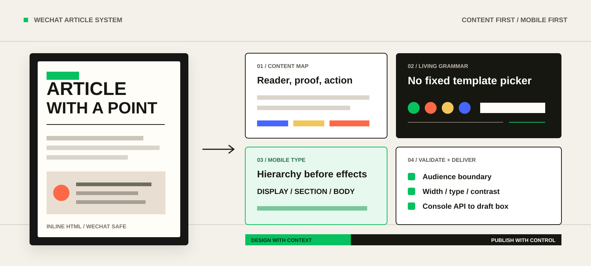
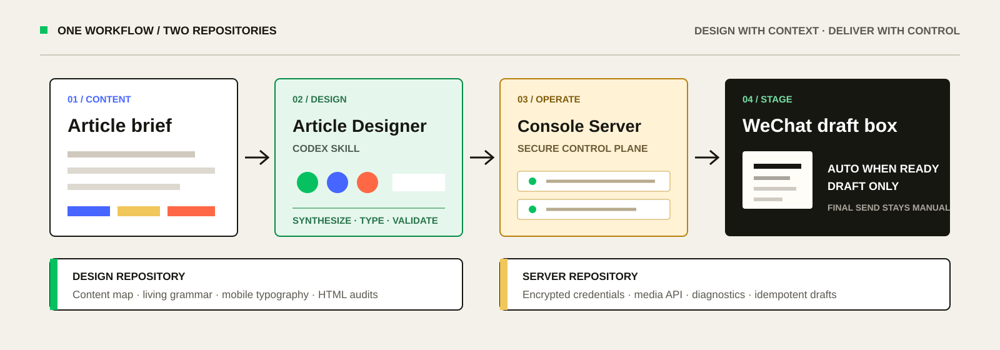

# WeChat Article Designer

[](https://github.com/juneme/wechat-article-designer/releases/latest)
[](https://github.com/juneme/wechat-article-designer/actions/workflows/ci.yml)
[](LICENSE)
[](https://github.com/juneme/wechat-console-server)



面向微信公众号的 Codex Skill。它先理解文章的读者、事实、图片与行动目标，再综合持续学习的设计语法，为当前内容生成专属结构和移动排版；不是从固定 HTML 模板中挑一个套用。

## 完整项目 = Skill + Server

| 设计端：本仓库 | 交付端：[`wechat-console-server`](https://github.com/juneme/wechat-console-server) |
|---|---|
| 内容地图、原创视觉综合、中文移动排版、兼容性审查 | 加密托管公众号凭据、上传图片、接口诊断、幂等写入草稿箱 |
| 安装在运行 Codex 的电脑上 | 部署在有固定公网出口 IP 的服务器上 |
| 不读取 AppSecret，不自动群发 | 不负责写文章，不向浏览器或 AI 暴露 AppSecret |



## 它如何设计

| 阶段 | 产出 |
|---|---|
| 理解内容 | 读者、叙事、事实、图片、证据与行动目标的内容地图 |
| 综合风格 | 从动态设计语法生成本文专属的色彩、构图、媒介节奏与视觉母题 |
| 组织文字 | 为标题、章节、正文、标签、说明和数据建立中文移动排版层级 |
| 构建文章 | 生成带内联样式的公众号 HTML 片段，并为不稳定效果提供静态降级 |
| 管理版本 | 每篇文章使用独立工作区，同步片段、预览、草稿 JSON、资产与历史版本 |
| 校验交付 | 审查受众边界、宽度、字距、对比度与编辑器兼容性，按授权预览或写入草稿 |

设计知识会持续扩展，但不会变成模板选择器。每次创作都必须从当前文章重新建立内容结构与设计契约；历史案例只提供可组合的设计能力。

## 安装

```powershell
git clone https://github.com/juneme/wechat-article-designer.git "$env:USERPROFILE\.codex\skills\wechat-article-designer"
```

重新启动 Codex 或创建新任务，使 Skill 完成重新发现。然后可以直接说：

```text
使用 $wechat-article-designer 制作这篇公众号文章，先预览，不要写入草稿箱。
```

## 连接 Console Server

先按 [`wechat-console-server` 部署说明](https://github.com/juneme/wechat-console-server#三步开始)准备服务端，再从控制台“API 接入 → Skill 客户端配置”取得以下三个变量：

```text
WECHAT_CONSOLE_URL
WECHAT_IMAGE_API_KEY
WECHAT_PUBLISH_API_KEY
```

密钥只配置在运行 Codex 的用户环境中，不得写入 Skill、文章 JSON、Issue 或公开仓库。连接后可先执行只读检查：

```powershell
python scripts/wechat_console_api.py status
```

完整的图片上传、封面处理、草稿校验和幂等规则见 [`references/direct-publishing.md`](references/direct-publishing.md)。预览、排版和上传图片都不代表授权创建草稿；写入草稿箱也不等于正式群发。

## 文章工作区

先为文章建立独立目录，避免下一篇文章覆盖当前资产：

```powershell
python scripts/article_workspace.py create --title '文章标题' --date 'YYYY-MM-DD'
```

编辑 `fragment.html` 和 `article.json` 后执行同步：

```powershell
python scripts/article_workspace.py sync '.\articles\日期_标题'
```

同步会更新服务端草稿正文、生成无脚本预览、仅在草稿数据变化时轮换幂等 ID，并把已准备状态归档到 `revisions/`。详见 [`references/article-workspaces.md`](references/article-workspaces.md)。预览页不提供剪贴板复制功能。

## SVG 互动排版

SVG 是 Creative 模式中的稳定编辑能力。需要揭晓、对比、切换、横向序列、形态变化或节奏强调时，按 [`references/svg-design-genes.md`](references/svg-design-genes.md) 从文章内容和 Visual DNA 原创组件。关键信息应在初始状态或相邻正文中完整可读，不需要重复的静态回退块或额外的 SVG 验证流程。

## 持续学习

学习新设计来源时，只把可复用的文字、构图、媒介、节奏和交互关系合并进核心设计语法；全部研究过程材料都留在 Skill 之外并在综合后丢弃。

## 验证

```powershell
$env:PYTHONUTF8='1'
python "$env:USERPROFILE\.codex\skills\.system\skill-creator\scripts\quick_validate.py" .
python -m compileall -q scripts
python -m ruff check .
```

生成文章后再运行受众边界、移动宽度、中文排版和颜色对比审查：

```powershell
python scripts/audit_audience_boundary.py article.html
python scripts/audit_wechat_widths.py article.html
python scripts/audit_wechat_typography.py article.html
python scripts/audit_wechat_contrast.py article.html
```

浏览器预览不能替代微信公众号编辑器与手机预览。仓库不携带固定文章 HTML、研究过程数据、本地文章数据或真实公众号凭据。

## License

MIT License. See [`LICENSE`](LICENSE).
