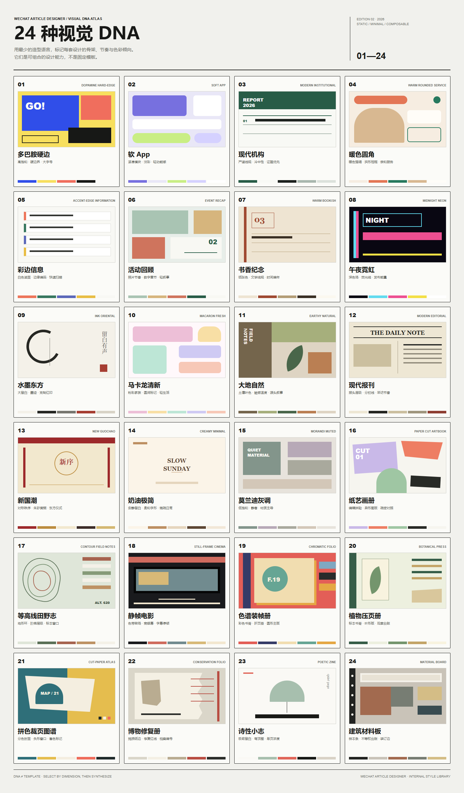

# WeChat Article Designer

面向微信公众号文章设计与草稿交付的开源 Codex Skill。基于 24 种内部视觉 DNA 合成原创版式，输出移动端 HTML、图片占位、封面方案与发布前审查结果。



## 核心能力

- 24 种可组合视觉 DNA，避免将模板换色误作原创设计。
- Steady / Creative 两种交付模式与明确的兼容性降级规则。
- Paper Cut Artbook、Contour Field Notes、Still-frame Cinema 等艺术编辑方向。
- 手机优先排版、照片占位、仅限最终区块实测的手动横向滑块和发布前风险审查。
- 发布前扫描源请求回声、工作流叙述、验证痕迹与本地路径。
- 照片框使用可编辑段落锚点：视觉样式和高度保留在 `section`，1px `p` 仅提供光标位置。
- 公众号正文保持静态，不包含动效或状态性交互。
- 通过独立服务 API 上传正文图片和封面；完整直发流程在校验通过后写入微信公众号草稿箱。

## 安装

```powershell
git clone https://github.com/juneme/wechat-article-designer.git "$HOME/.codex/skills/wechat-article-designer"
```

重新启动 Codex 或创建新任务，使 Skill 完成重新发现。

直发模式需要配置以下环境变量：

```text
WECHAT_CONSOLE_URL=https://console.example.test:8791
WECHAT_IMAGE_API_KEY=image-api-bearer-key
WECHAT_PUBLISH_API_KEY=draft-api-bearer-key
```

完整流程见 `references/direct-publishing.md`。密钥不得写入 Skill、文章 JSON 或公开仓库。HTTP 兼容无域名部署，但会明文传输 Bearer Key 和文章数据；生产部署应使用 HTTPS。

## 设计路由

默认流程根据主题、受众、图片职责、信息密度和期望行动，从多个 DNA 维度合成设计指纹。样式浏览仅在明确选择该路由时展示 24 种 DNA 总览；命名模板仅作为结构起点。

## 目录

```text
wechat-article-designer/
├── SKILL.md
├── GALLERY.md
├── agents/
├── assets/
├── references/
└── scripts/
```

## 验证

```powershell
$env:PYTHONUTF8='1'
python "$HOME/.codex/skills/.system/skill-creator/scripts/quick_validate.py" .
python scripts/audit_audience_boundary.py article.html
python scripts/audit_wechat_widths.py article.html
```

## 发布边界

- 最终公众号正文不使用脚本、事件处理器、外部样式表或本地图片路径。
- 写入草稿箱不等于正式发布；最终群发仍需在微信公众号后台完成预览与确认。
- 手动换图使用空白照片框内的 1px 段落锚点。
- 手动横向滑块不得使用超宽中间层或裁切祖先层；必须另备单列版本，并以最终内容通过真实草稿箱验证。
- 浏览器预览不能替代公众号草稿箱与手机预览验证。

## License

MIT License. See `LICENSE` in the project root.
